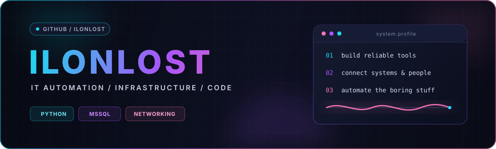
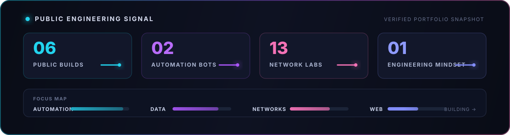

  

   

  
  
  

    

  

## 🇷🇺 Русский

<b>О профиле</b>

 

Я создаю прикладные инструменты для внутренних IT-процессов: автоматизирую рутинные операции, связываю Telegram-интерфейсы с корпоративными данными и превращаю сложные действия в понятные рабочие сценарии.

- Проектирую ботов для управления задачами, пользователями и оборудованием.
- Интегрирую Python-приложения с Microsoft SQL Server.
- Автоматизирую учёт активов, инвентаризацию и формирование документов.
- Развиваю web-интерфейсы и инфраструктурные инструменты для ежедневной работы.
- Делаю упор на практическую пользу, прозрачную логику и дальнейшую масштабируемость.

## 🇬🇧 English

<b>About this profile</b>

 

I build practical tools for internal IT operations: automating routine work, connecting Telegram interfaces to operational data, and turning complex processes into clear, repeatable workflows.

- Building bots for task, user and equipment management.
- Integrating Python applications with Microsoft SQL Server.
- Automating asset tracking, inventory and document generation.
- Developing web interfaces and infrastructure tools for everyday operations.
- Focusing on useful outcomes, explicit logic and future scalability.

## `> tech_stack / технологии`

  
  
  
  
  
  
  

## `> featured_projects / проекты`

<table>
<tr>
<td width="50%" valign="top">

### [🤖 bot_MainIT](https://github.com/ilonlost/bot_MainIT)

<b>🇷🇺 Конструктивно</b>

 

<b>Задача:</b> единая Telegram-точка входа для оперативной работы с IT-задачами, пользователями и оборудованием.

<b>Реализовано:</b> CRUD-операции, статусы и приоритеты задач, назначение исполнителей, плановые операции, генерация документов и QR-кодов, интеграция с MS SQL Server.

<b>🇬🇧 Constructive overview</b>

 

<b>Purpose:</b> a single Telegram entry point for operational work with IT tasks, users and equipment.

<b>Implemented:</b> CRUD workflows, task status and priority management, assignees, scheduled operations, document and QR-code generation, and MS SQL Server integration.

`Python` `pyTelegramBotAPI` `pyodbc` `MSSQL`

</td>
<td width="50%" valign="top">

### [📦 bot_SkladIT](https://github.com/ilonlost/bot_SkladIT)

<b>🇷🇺 Конструктивно</b>

 

<b>Задача:</b> автоматизация жизненного цикла складских IT-активов и снижение объёма ручного учёта.

<b>Реализовано:</b> добавление, редактирование, поиск и списание активов, адресное хранение по ячейкам, инвентаризация, формирование актов и работа с MS SQL Server.

<b>🇬🇧 Constructive overview</b>

 

<b>Purpose:</b> automate the lifecycle of warehouse IT assets and reduce manual record keeping.

<b>Implemented:</b> asset creation, editing, search and retirement, storage-cell management, inventory workflows, document generation and MS SQL Server integration.

`Python 3.12` `Telegram Bot` `pyodbc` `MSSQL`

</td>
</tr>
<tr>
<td colspan="2" valign="top">

### [🖥️ webIT](https://github.com/ilonlost/webIT)

<b>🇷🇺 Конструктивно</b>

 

<b>Задача:</b> создание web-основы для представления внутренних IT-сценариев в более наглядном интерфейсе.

<b>Направление развития:</b> структурирование UI, отображение операционных данных и перенос полезных сценариев из ботов в web-формат.

<b>🇬🇧 Constructive overview</b>

 

<b>Purpose:</b> provide a web foundation for presenting internal IT workflows through a clearer visual interface.

<b>Development direction:</b> structured UI, operational data presentation and moving useful bot workflows into a web format.

`HTML` `Web UI` `Internal IT Tools`

</td>
</tr>
</table>

  <a href="https://github.com/ilonlost?tab=repositories"><b>Все репозитории / Explore all repositories →</b></a>

## `> engineering_signal / инженерный_сигнал`

  

 

  <code>создавать полезное · автоматизировать разумно · видеть состояние систем</code>
   
  <code>build useful things · automate wisely · keep systems observable</code>
    
  

