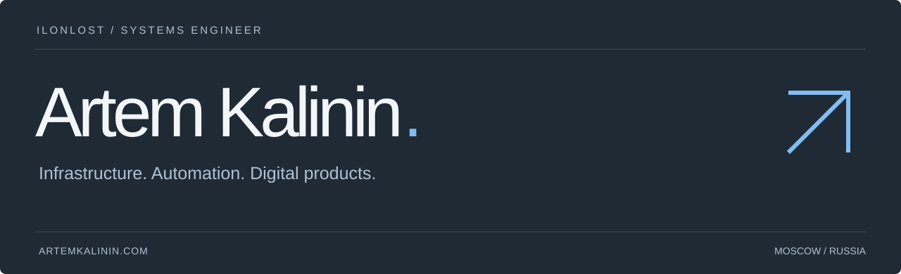

  

**Системный инженер и создатель цифровых продуктов.**

Соединяю инфраструктуру и разработку: строю надёжные системы, автоматизирую повседневную работу и создаю понятные инструменты для команд.

[Портфолио RU](https://xn--80aaonajifnbyy.xn--p1ai/) · [Portfolio EN](https://artemkalinin.com/) · [Telegram](https://t.me/ag_kalinin) · [Email](mailto:i@lonlost.ru)

### Избранные проекты

| Проект | Что решает |
| :--- | :--- |
| **[AloneLost Jobs](https://work.lonlost.com/vacancies)** | Поиск работы, рекомендации и история откликов в одном пространстве. Доступ предоставляю лично — [написать](https://t.me/ag_kalinin). |
| **Process Portals** · [Art](https://github.com/ilonlost/art-portal) / [Plan](https://github.com/ilonlost/plan-portal) / [Specifications](https://github.com/ilonlost/specificationWEB) | Готовность артикулов, производственное планирование и спецификации: ответственные, сроки и история. |
| **[RDS Farm Panel](https://github.com/ilonlost/RDSfarmPanel)** | Наблюдение за RDS-фермой, сессиями и узлами; роли и аудит. Проект развивается. |
| **[FK Portal](https://github.com/ilonlost/fk-portal)** | Единая точка входа в корпоративные ресурсы с Active Directory и доступом по отделам. |
| **[bot_MainIT](https://github.com/ilonlost/bot_MainIT)** / **[bot_SkladIT](https://github.com/ilonlost/bot_SkladIT)** | Telegram-инструменты для ИТ-задач, активов, инвентаризации и документов. |

Часть проектов — внутренние системы с закрытыми репозиториями. Описания отражают назначение, а не обещание публичного доступа.

### Исследования

Соавтор **Risk-Managed Consilium of Heterogeneous Detectors with Safe Degradation for Critical Infrastructure Visual Inspection**. Работа принята к **ESEPE 2026** (30 октября — 1 ноября, Сиань, Китай). Статус: принято к конференции; публикация и индексация пока не подтверждены. [Письмо организаторов](https://artemkalinin.com/documents/esepe-2026-acceptance.pdf).

### Инженерный фундамент

**Systems** — Windows Server · Linux · Active Directory · VMware ESXi · Hyper-V  
**Networks** — Cisco · MikroTik · Huawei · VLAN · UserGate  
**Reliability** — Veeam · Zabbix · Grafana · NAS  
**Automation** — PowerShell · Bash · Python · Docker · Git

Поддержка **200+ пользователей**, объединение **трёх сетей** в общую инфраструктуру, внедрение мониторинга и резервного копирования с нуля. Профессиональный путь в ИТ — с 2021 года.

---

### English

I’m **Artem Kalinin**, a systems engineer who builds digital products. I connect reliable infrastructure with useful software: internal portals, operational tools and automation that removes repetitive work.

My work spans Windows and Linux, networking, virtualization, monitoring and backups. I have supported **200+ users**, unified **three networks**, and introduced monitoring and backup systems from scratch.

I build AloneLost Jobs, business workflow portals, RDS management tools and a unified corporate IT portal. Some repositories are private; access to AloneLost Jobs is available by personal request.

[Explore my work](https://artemkalinin.com/) · [Get in touch](mailto:i@lonlost.ru)

Build useful things. Make them reliable. Keep them understandable.

